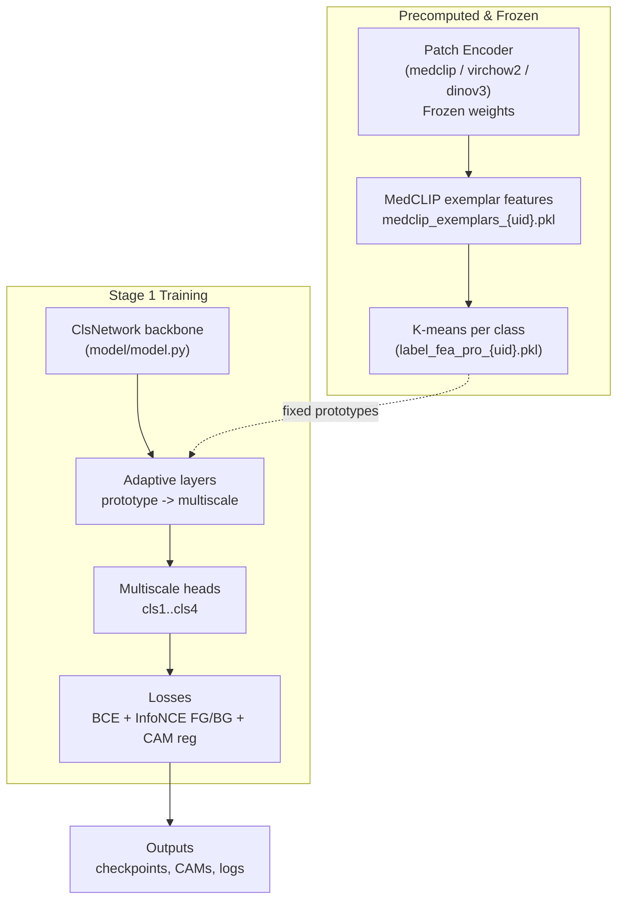

# Training Components (per paper)

Components that are trained and how they map to the PBIP codebase.

## Patch encoder (frozen or finetuned)
- Options: medclip, virchow2, dinov3 (select via `model.patch_encoder`)
- Default usage: encoder weights are **frozen** during Stage 1; used only for feature extraction
- Location: `utils/encoders.py` factory

## Label prototypes (learned via clustering, not SGD)
- Built from MedCLIP exemplar features using k-means per class
- Script: `features/k_mean_cos_per_class.py`
- Output: `label_fea_pro_{uid}.pkl` consumed by the classifier

## Classification backbone (trained)
- Model: `model/model.py` (ClsNetwork)
- Backbone: configurable (`model.backbone.config`, e.g., mit_b1)
- Trainable parts:
  - Multiscale classifier heads (cls1–cls4)
  - Adaptive layers (`AdaptiveLayer`) that map label prototypes to multiscale features
  - Final classification logits per scale

## CAM generation and losses (trained)
- Losses: multi-scale BCE, contrastive (InfoNCE FG/BG), CAM regularization
- Implemented in `train_stage_1.py`
- Contrastive prototypes come from label prototypes (fixed during training)

## What is NOT trained in Stage 1
- Patch encoder weights (frozen)
- MedCLIP exemplar features (precomputed)
- Label prototypes (precomputed via k-means)

## Checkpoints & artifacts
- Checkpoints: `output_dirs.ckpt_dir/<timestamp>/best_cam.pth`
- Predictions/CAMs: `output_dirs.pred_dir/*.png`
- Label prototypes: `features/label_fea_pro_{uid}.pkl`
- MedCLIP exemplar features: `features/medclip_exemplars_{uid}.pkl`
- Coordinate sets: `prototype_coordinates/{class}_{uid}.npy`

## Next steps
- Follow-on work (paper arXiv:2503.12068): train a DeepSeek vision/VLM model on the Stage 1 CAMs as pseudo-labels. See [docs/next_steps.md](docs/next_steps.md) for the workflow and open items to align with the paper.
