## Stage 0: Prototype Coordinate Extraction

## Stage 1: MedCLIP Feature Extraction

## Stage 2: K-Means Clustering → Prototypes

```mermaid
    graph TB
        subgraph Input["📥 INPUT"]
            A1["medclip_exemplars.pkl<br/>all embeddings"]
            A2["Config<br/>k_list, class_order"]
        end

        subgraph Process["K-Means Clustering"]
            B1["Load embeddings<br/>group by class"]
            B2["For each class:<br/>k-means (k=3)"]
            B3["Extract cluster centers<br/>3 benign + 3 tumor"]
            B4["Combine into prototype<br/>tensor: 6 × 512"]
        end

        subgraph Metadata["Create Metadata"]
            C1["k_list: [3, 3]"]
            C2["class_order: [benign, tumor]"]
            C3["cumsum_k: [0, 3, 6]"]
        end

        subgraph Output["📊 OUTPUT"]
            D1["label_fea_pro.pkl<br/>prototypes + metadata"]
        end

        A1 & A2 --> B1
        B1 --> B2
        B2 --> B3
        B3 --> B4
        B4 --> C1
        C1 & C2 & C3 --> D1

        style Input fill:#B3E5FC,stroke:#01579B,stroke-width:3px
        style Process fill:#E8F5E9,stroke:#1B5E20,stroke-width:2px
        style Metadata fill:#F3E5F5,stroke:#4A148C,stroke-width:2px
        style Output fill:#F1F8E9,stroke:#33691E,stroke-width:3px
```

## Stage 3: Training with Weak Supervision

## Stage 4: Validation & Evaluation

## Stage 5: Inference on New WSIs

## Complete End-to-End Pipeline

